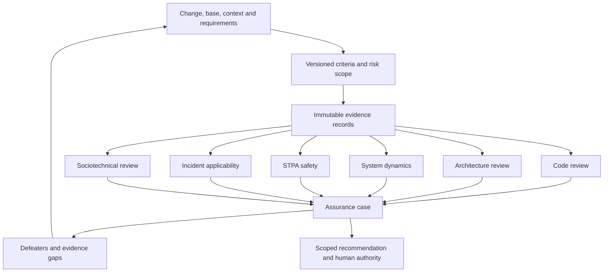

# Architecture and Independence

## Evaluation of the proposed pipeline

The proposed disciplines are complementary, but a linear chain risks turning an early conclusion into an unexamined premise for later reviewers. Use a shared evidence store and separate assessments, followed by an assurance case. A scheduling order is useful; it is not an epistemic dependency.

## Capability map

| Module | Provides | Depends on |
| --- | --- | --- |
| evidence-layer | Revision-bound raw artifacts and collection receipts | Repository and approved tools |
| code-reviewer | Local behavioral findings | Criteria, evidence contracts |
| architecture-reviewer | Structural conformance and quality-attribute scenarios | Criteria, evidence contracts |
| system-dynamics-reviewer | Time-dependent mechanisms and explicitly labeled models | Operational context and evidence |
| safety-stpa-reviewer | Loss-to-constraint analysis | System purpose, control structure and evidence |
| incident-memory | Mechanism-based analogues with disanalogies | Curated cases and applicability evidence |
| sociotechnical-reviewer | Coordination requirements versus observed responsibility | Technical dependencies and ownership evidence |
| final-engineering-judge | Challenged assurance argument and scoped recommendation | Validated envelopes and raw evidence |

Each specialist may request additional observations from the evidence layer. Cross-reviewer claims remain cited claims, not raw observations. An integrator routes a disputed claim back to the responsible specialist instead of silently replacing its analysis.

## Independence ledger

Record model family/version, prompt digest, session identifier, raw evidence identifiers, shared context, prior conclusions seen, rubric timing and dependencies. Different sessions are not evidence independence; different providers are not automatically independent either. Repeated analyses of the same test output count as one observation. Shared training bias generally remains an unquantified dependence.

Initially assess specialists from criteria and raw evidence without sibling verdicts. In a second challenge pass, expose specific conflicting claims with provenance. Preserve both versions. Record whether new evidence or only a changed argument caused revision. Do not count a challenge pass as an independent confirmation.

## Evidence acquisition design

Use Git merge-base against the actual target, recording immutable base/head IDs and dirty-tree content separately. Store staged, unstaged and untracked coverage explicitly. Collect tool version, command, exit status, output digest, time, scope and skipped files. Code is untrusted input: no imports during parsing, no instructions taken from comments, and no automatic execution of repository scripts.

Compiler, tests, lint, static analysis and formal tools are adapters selected by the project; their absence is a coverage gap, not success. Dependency and call graphs must record language coverage and resolution limits. The existing Python helper is lexical discovery only. ADR extraction preserves status, supersession and decision scope. CODEOWNERS identifies configured routing, not demonstrated operational ownership. Runtime traces require context, sampling and retention information.

No runtime collectors beyond the existing helper are implemented in this phase. Incident retention requires explicit authorization, redaction and source integrity; reviewing an incident does not automatically authorize saving organizational data.
